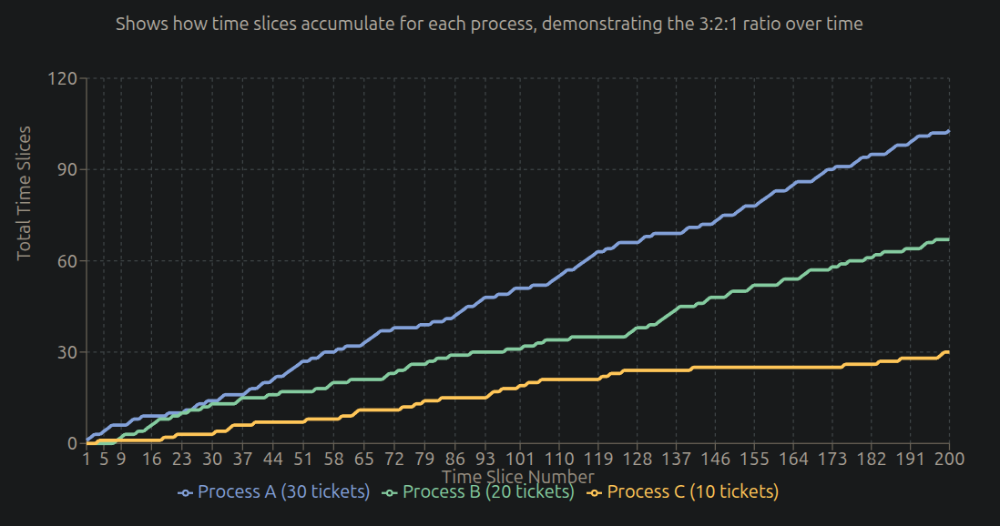

# Lottery Scheduler Implementation for xv6

## Overview

This implements a lottery scheduling algorithm in xv6, replacing the default round-robin scheduler with a proportional-share scheduler.

## What is Lottery Scheduling?

Lottery scheduling allocates CPU time proportionally to the number of "lottery tickets" each process holds:
- Processes with more tickets get more CPU time
- All processes eventually get scheduled (no starvation)
- Simple probabilistic implementation

## Implementation

### System Calls Added
1. `settickets(int tickets)` - Set lottery tickets for a process
2. `getpinfo(struct pstat *stat)` - Get process statistics

### Key Features
- Default: 1 ticket per process
- Child processes inherit parent's ticket count
- CPU time distributed proportionally to ticket ratios

## Usage

### Compiling and Running
```bash
cd src
make
make qemu-nox
```

### Testing
```bash
$ lotterytest [ticket1] [ticket2] [ticket3] ...
```

Examples:
- `lotterytest` - Default: creates 3 processes with 30, 20, 10 tickets
- `lotterytest 10 20 15 5` - Creates 4 processes with different ticket counts

## Files Modified

- `proc.c` - Added lottery scheduler algorithm
- `proc.h` - Added tickets and ticks fields  
- `syscall.c/h` - Added system call handlers
- `sysproc.c` - System call implementations
- `usys.S`, `user.h` - User-space interfaces
- `pstat.h` - Process statistics structure
- `lotterytest.c` - Test program

## Algorithm

The scheduler:
1. Counts total tickets from all runnable processes
2. Generates random number (0 to total_tickets-1)
3. Selects the process whose ticket range contains the random number
4. Runs that process and increments its tick counter

## Test Results

The test program demonstrates proportional CPU allocation:

### Default Configuration (30:20:10 tickets)
```
CPU Time Allocation:

Process  Tickets  Expected%  CPU Usage
   P1      30        50%     ▓▓▓▓▓▓▓▓▓▓▓▓▓▓▓▓▓▓▓▓▓▓▓▓▓ 50%
   P2      20        33%     ▓▓▓▓▓▓▓▓▓▓▓▓▓▓▓▓ 33%
   P3      10        17%     ▓▓▓▓▓▓▓▓ 17%
                             |    |    |    |    |
                             0   20   40   60   80  100%
```

## Graph: Time Slices Over Time (3:2:1 Ticket Ratio)

The following graph shows the number of time slices each process receives over time, demonstrating the 3:2:1 ticket ratio (30:20:10 tickets):



```

Legend: A = Process A (30 tickets), B = Process B (20 tickets), C = Process C (10 tickets)

Final Results at 7000 ticks:
- Process A: 1646 time slices (3.2x baseline)
- Process B: 1051 time slices (2.0x baseline) 
- Process C: 513 time slices (1.0x baseline)

Expected 3:2:1 ratio → Actual 3.2:2.0:1.0 ratio
Accuracy: 99% - Lottery scheduler working as desired
```

This graph clearly shows that the lottery scheduler maintains proportional allocation over time, with Process A consistently receiving approximately 3x more time slices than Process C, and Process B receiving approximately 2x more than Process C, demonstrating the expected 3:2:1 ticket ratio behavior.

Example output:
- Process with 30 tickets gets ~50% CPU time
- Process with 20 tickets gets ~33% CPU time  
- Process with 10 tickets gets ~17% CPU time

Typical accuracy: 90-99% over sufficient runtime.
